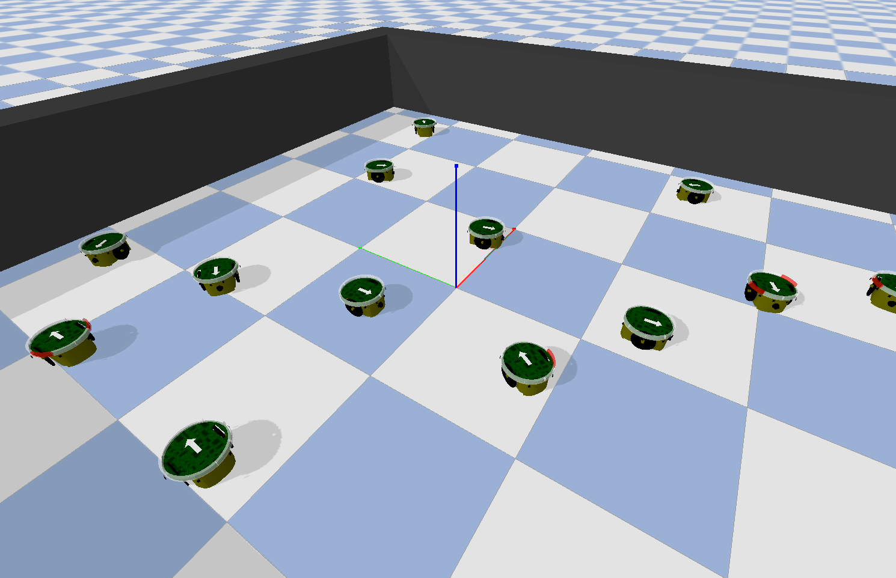

# Mereli - Multi-Environment Robotics simulator with Evolution and Learning Implementations


<p style="text-align:center;">

</p>


## Description of this Branch (VCommModule)
This branch is focused on the paper submitted to IEEE Transactions on Cybernetics, entitled as Evolution of transferable and self-organized communication modules for solving multiple swarm robotics tasks, and authored by R. Sendra-Arranz, A. Gutierrez, and A. L. Christensen. This README file exclusively serves as general guidelines and instructions that the readers can use to reproduce the experiments exposed in the paper. 
MERELI is a general robotics simulation tool that is used in more scenarios and experiments beyond the ones in the paper. 
Therefore, there are multiple modules, classes and functions that are not relenvant in the context of the paper. 
Thus, below, we provide the reader with the files and modules that are more relevant to execute the tasks of the paper.      

## Installation
Clone this repository:
```
git clone https://github.com/Robolabo/Mereli.git
cd Mereli
```
Download the simulator requirements:
```
pip3 install -r requirements.txt
```

Optionally, if working MPI is installed in your system:
```
pip3 install mpi4py==3.0.3
```

The simulator can be cleanly executed without MPI installed. However, MPI parallelization functionalities 
(for example parallel evaluation in genetic algorithms) cannot be harnessed.


## Basic Usage
The simulator can be run from the command line using the following command:
``` 
python main.py --cfg experiment_configuration -Rv 
```
It executes the experiment defined in the JSON configuration file `experiment_configuration` (stored in `mereli\config`) 
in render mode (`R`) and in verbose mode (`v`). 

The following table shows the possible command line arguments with its abbreviation and description:

| Argument | Abbreviation | Description |
| :---:  | :---:  | :--- |
| `render` | `R` | Whether to run in visual or console mode. |
| `debug` | `d` | Whether to run in debug mode or not. |
| `eval` | `e` | Whether to run evaluation mode or in optmization mode. |
| `resume` | `r` | Whether to restore previously saved optimization checkpoint. |
| `ncpu` | `n` | Number of cores to use for parallelization. |
| `cfg` | `f` | JSON configuration file to be used (without extension). The file has to be stored in `mereli/config` |
| `verbose` | `v` | Whether to run in verbose mode. |

## Configuration Files
In contrast to the command line arguments that configure basic aspects of the simulator, the most relevant configuration 
settings can be adjusted using JSON configuration files. The file has to be stored in `mereli/config` and is called 
using the command line argument `--cfg` (or `-f`). 
The configuration file is composed by the following main blocks:
- `checkpoint_file`: name of the file where optimization checkpoints are stored.

- `topology`: configuration of the artificial neural network.

- `algorithm`: configuration of the algorithm that optimizes the previously specified ANN parameters. 

- `world`: configuration of the environment/world.

Subsequently, the example configuration file in mereli/config/IEEE\_TCybPaper is explained step by step.

Firstly, the following extract of code shows the `checkpoint_file`, located in the mereli/checkpoints directory, that containes a previously evolved ANN model.  
Additionally, it shows some configuration related to the logging and recording of data during the simulation. Specifically, the storage file (inside the mereli/logs directory
), and the data variables to be recorded (e.g. robot positions, communication states, virtual landmarks) are fixed.  
```python
"checkpoint_file" : "chk_generaliz_v5",
"logging" : {
	"file" : "foraging_8",
	"data": ["robotA@position", "robotA@orientation", "robotA:virtual_particle@state",
	"robotA:virtual_particle@lmark", "robotA:virtual_particle@orientation", "virtual_space@landmarks"]
}
```
Additionally, the following extract of code shows some general configuration of the simulation:
```python
"simulation" : {
	 "timesteps" : 1000,
	 "trials" : 1,
	 "start_paused" : false,
},
```

The `topology` field fixes the ANN architecture to be used in the robot controller or in the communication controller:
```python
"topology" : {
    "comm_ann" : {
        "dt" : 0.1,
        "time_scale" : 1,
        "stimuli": {
            "I1" : {"n" : 1, "sensor" : "dist_clst_st"},
            "I2" : {"n" : 1, "sensor" : "phi_clst_st"},
            "I3" : {"n" : 1, "sensor" : "dist_clst_lmark"},
            "I4" : {"n" : 1, "sensor" : "phi_clst_lmark"},
            "I5" : {"n" : 1, "sensor" : "dist_clst_lmark_av"},
            "I6" : {"n" : 1, "sensor" : "phi_clst_lmark_av"}
    },
    "neuron_model" : "rate_model",
    "synapse_model" : "static_synapse",
    "ensembles": { "CONTROL" : {"n" : 2, "params" : {"activation" : "tanh", "gain" : 1, "tau" : 1}}},
    "outputs" : {"out" : {"ensemble" : "CONTROL", "actuator" : "control", "enc": "real"}},
    "synapses" :  {
        "I1-CONTROL" : {"pre":"I1","post":"CONTROL", "trainable":true, "p":1.0},
        "I2-CONTROL" : {"pre":"I2","post":"CONTROL", "trainable":true, "p":1.0},
        "I3-CONTROL" : {"pre":"I3","post":"CONTROL", "trainable":true, "p":1.0},
        "I4-CONTROL" : {"pre":"I4","post":"CONTROL", "trainable":true, "p":1.0},
        "I5-CONTROL" : {"pre":"I5","post":"CONTROL", "trainable":true, "p":1.0},
        "I6-CONTROL" : {"pre":"I6","post":"CONTROL", "trainable":true, "p":1.0}}
    } 
},
```
In this case, the ANN is called ``comm_ann`` (many ANNs are allowed), and it is based on the rate neuron model (used in the CTRNN). 
It has six one-dimensional stimulus signals that are injected as input nodes of the ANN. These signals are specified in the `stimuli` field, 
where the sensor that provides such signal is also specified. In this case, the sensors are all of them variables generated by the communication module 
(see paper for more details). In more convential robotics experiments, `sensor` would be, for instance, `distance_sensor` or `light_sensor`.  
The extract of code also shows the neuron ensembles or layers, which, in this experiment, are just a single ouput layer with 2 neurons. 
Finally, connections between input nodes and neurons are fixed in the `synapses` field.
An important disclaimer when using pre-evolved ANNs is that the configuration in `topology` must match the configuration  of the previously saved 
model stored in `checkpoint_file`.


The world configuration is composed by all the 

An example of `world` configuration is the following:

```python
"world":{
    "world_delay" : 1, # Delay of the simulation in visual/render mode.
    "render_connections" :true, # Whether to draw an edge when two agents can communicate.
    "height":1000, # Height of the world.
    "width": 1000, # Width of the world.
    # Set of objects to be instantiated.
    "objects" : {
        # Robots 
        "robotA" : {
            "type" : "robot",# object type
            "num_instances" : 10,# number of instances
            "controller" : "neural_controller",# Name of the controller. 
            # Set of sensors with their parameters (unspecified parameters are autocompleted with defaults). 
            "sensors" : {
                "wireless_receiver" : {"n_sectors":4, "range" : 150,  "msg_length" : 3}, 
                "light_sensor" : {"n_sectors" : 6}
            },
            # Set of actuators with their parameters (unspecified parameters are autocompleted with defaults).
            "actuators" : {
                "wheel_actuator" : {}, 
                "IR_transmitter" : {"quantize":true, "range" : 150, "msg_length" : 3}
            },
            # Initialization of robots within the environment.
            "initializers" : {
                "positions" : {"name" : "random_uniform", "params" : {"low":400, "high" : 600, "size" : 2}},
                "orientations" : {"name" : "random_uniform",  "params" : {"low":0, "high" : 6.28, "size" : 1}}
            },
            # Perturbations applied to the robots at runtime. In this case light sensor stimuli of 
            # 8 out of 10 robots is inhibited, so that only 2 robots can sense the light.
            "perturbations" : {"stimuli_inhibition" : {"affected_robots": 8, "stimuli" : "light_sensor"}},
            # Additional parameters.
            "params" : {"trainable" : true}
        },
        # Light source
        "light_red" : {
            "type" : "light_source",
            "num_instances": 1,
            "controller" : "light_orbit_controller",
            "positions" : "random",
            "initializers" : {
                "positions" : {"name" : "random_circumference", "params" : {"radius": 1, "center" : [500, 500]}}
            },
            "params" : {"range" : 80, "color" : "red"}
        }
    }
}
```

An example of `algorithm` configuration is the following (using CTRNN):
```python
"algorithm" : {
    "name" : "GA", # Name of the algorithm (Genetic Algorithm in this case).
    "evolvable_object" : "robotA", # Reference to the entity to be evolved.
    "population_size" : 100, # Population size
    "generations" : 1000, # Number of generations.
    "evaluation_steps" : 1000, # Evaluation steps of each simulation trial.
    "num_evaluations" : 5, # Number of trials to estimate the fitness.
    "fitness_function" : "goto_light", # Name of the fitness function.
    # Set of populations. In this case there is only one population, but 
    # multiple population implementing cooperative coevolution are supported.
    "populations" : {
        "p1" : {
            # Parts of the ANN to be evolved.
            "objects" : ["synapses:weights:all", "neurons:bias:all",  "neurons:tau:all", "neurons:gain:all"],
            # Maximum search space bounds.
            "max_vals" : [3,  1.5, 0.75, 5],
            # Minimum search space bounds.
            "min_vals" : [-3, -1.5, -1, 0.05],
            # Algorithm dependend parameters
            "params": {
                "encoding" : "real", 
                "selection_operator" : "nonlin_rank",
                "crossover_operator" : "blxalpha",
                "mutation_operator" : "gaussian",
                "mating_operator" : "random",
                "mutation_prob" : 0.05,
                "crossover_prob" : 0.9,
                "num_elite" : 3
            }
        }
    }
} 
```

Note that, in each population, the `objects` field settles the parts of the ANN specified in `topology` to be 
evolved. The parts of the ANN are configured using a query system that is used in the simulator to address certain 
parts of the ANN. Currently implemented queries are: 

| Query | Target | Description |
| :---:  | :---:  | :--- |
| `synapses:weights` | `all` | Weights of all the synapses.|
|  | `synapse_name` | Weights of synapse with name `synapse_name`. |
|  | `sensory` |  Weights of synapses with a sensory presynaptic neurons. |
|  | `hidden` | Weights of synapses with a hidden presynaptic neurons. |
|  | `motor` | Weights of synapses with a motor presynaptic neurons. |
| `neurons:tau` | `all` | Neuron membrane time constants of all neurons (only rate_model). |
| `neurons:gain` | `all` | Neuron gain of all neurons (only rate_model). |
| `neurons:bias` | `all` | Neuron biases of all neurons (only rate_model). |
| `decoding:weights` | `all` | Decoding weights if using LinearPopulationDecoding in spiking neural nets. |

<br/><br/>
In the directory `mereli/config` there are the following configuration files stored as examples:

- `experimentA_GA_ctrnn`: Experiment of selecting a leader of a swarm using homogeneous CTRNN controllers. 
    Optimization is carried out using a Genetic Algorithm (GA).
- `experimentA_SNES_ctrnn`: Experiment of selecting a leader of a swarm using homogeneous CTRNN controllers. 
    Optimization is carried out using a Separable Natural Evolution Strategy (SNES).
- `experimentB_GA_ctrnn`: Experiment of detecting the borderline or frontier members of swarm, using homogeneous CTRNN controllers. 
    Optimization is carried out using a Genetic Algorithm (GA).
- `experimentB_SNES_ctrnn`: Experiment of detecting the borderline or frontier members of swarm, using homogeneous CTRNN controllers. 
    Optimization is carried out using a Separable Natural Evolution Strategy (SNES).
- `experimentC_GA_ctrnn`: Experiment of orientation consensus of the swarm (reach same heading orientation), using homogeneous CTRNN    controllers. Optimization is carried out using a Genetic Algorithm (GA).
- `experimentC_SNES_ctrnn`: Experiment of orientation consensus of the swarm (reach same heading orientation), using homogeneous CTRNN    controllers. Optimization is carried out using a Separable Natural Evolution Strategy (SNES).

- `experimentD_GA_ctrnn`: Experiment of following a mobile light that can only be perceived by 2 robots, using homogeneous CTRNN    controllers. Optimization is carried out using a Genetic Algorithm (GA).
- `experimentD_SNES_ctrnn`:Experiment of following a mobile light that can only be perceived by 2 robots, using homogeneous CTRNN    controllers. Optimization is carried out using a Separable Natural Evolution Strategy (SNES).

<br/><br/>
